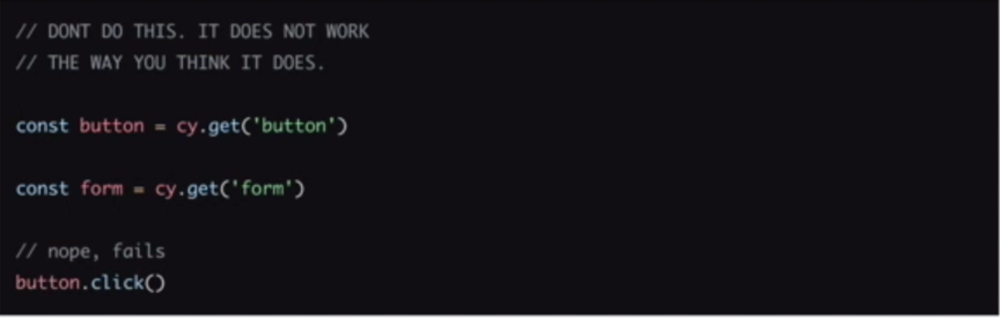
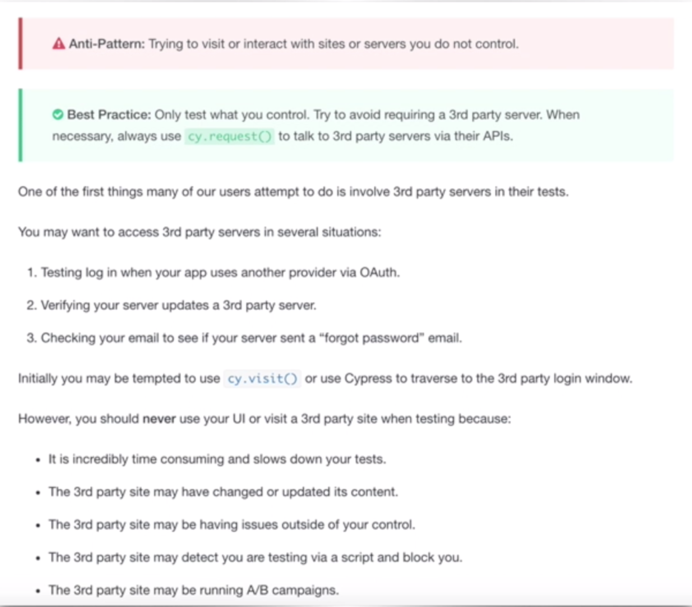
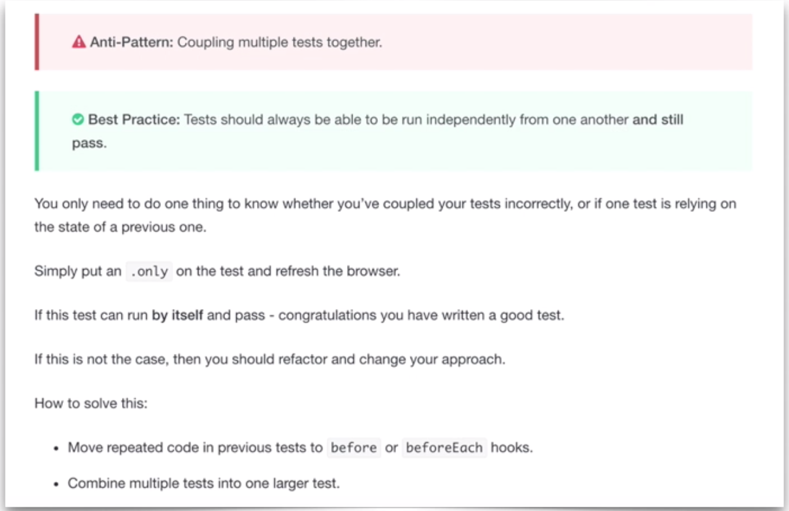
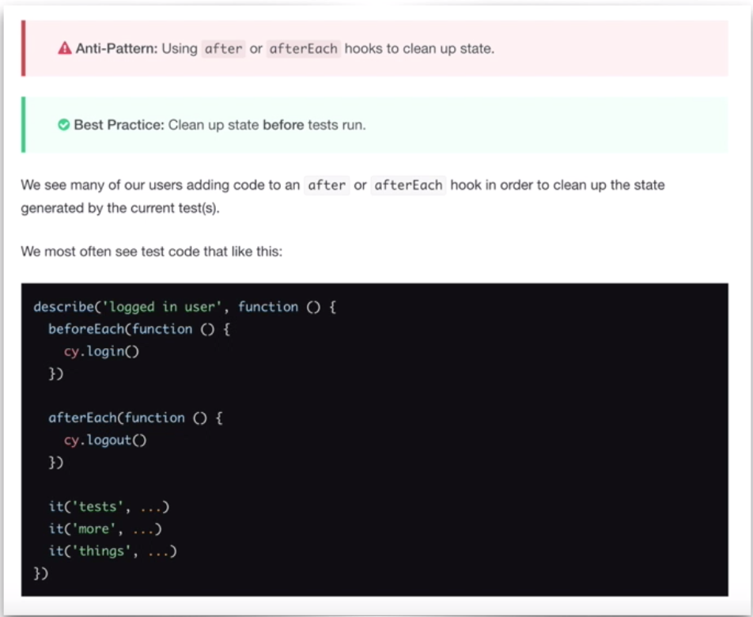
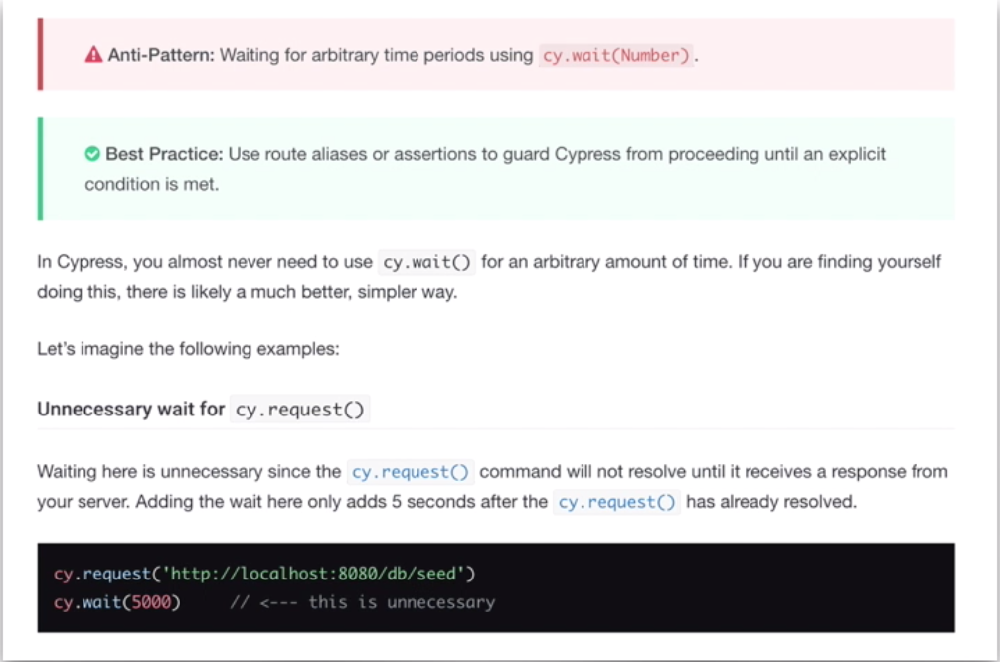

npm i cypress cypress-image-snapshot --save

# Cypress Image Snapshot

## Add to the following indexes:

### Cypress/plugins/index:

```
const { addMatchImageSnapshotPlugin } = require('cypress-image-snapshot/plugin')

module.exports = (on, config) => {
  addMatchImageSnapshotPlugin(on, config)
}
```

### Cypress/support/commands:
```
const { addMatchImageSnapshotCommand } = require('cypress-image-snapshot/command')
addMatchImageSnapshotCommand()
```

# Cypress XPath (if desired)

npm i --save cypress-xpath

https://www.w3schools.com/xml/xpath_intro.asp

### Cypress/support/index:

require('cypress-xpath')

# Cypress Best Practices

- avoid targeting attributes that are likely to change

- DON'T assign return value of Commands using const, let or var...it will fail


- Only test what you control...avoid requiring a 3rd party server


- Tests should always be able to run independently of one another and still pass (one of the most violated rules)


-  DO: Add multiple assertions to your tests...avoid tiny classes with singles assertions

- DON'T: use 'after' or 'after each' hooks simply to clean up state.


- AVOID using static waiting

